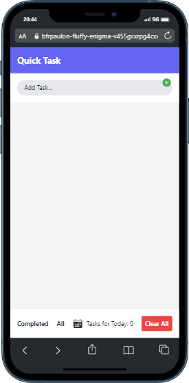

# Quick Task

.png>)
## Description
Quick Task is a simple to-do list app built in React Native. It allows users to create and manage their daily tasks quickly and efficiently.

## Functionalities
- Add a new task
- Mark a task as completed
- Edit an existing task
- delete a task
- Filter tasks by completed or view all
- Clear all completed tasks at once
- Intuitive and responsive interface

## Technologies used

- React Native
- Expo
- AsyncStorage for local data storage
- Tailwind CSS for modern and responsive styling
- Reanimated for smooth animations

## Prerequisites

- Node.js
- npm or Yarn
- ExpoCLI

## How to run the project

1. Clone the repository to your computer:

```
git clone https://github.com/your-user/quick-task.git

```

2. Navigate to the project folder:

```
cd quick-task

```

3. Install dependencies:

```
npm install
```
or
```
yarn install
```

4. Launch the application:

```
expo start
```

5. Use an emulator or scan the QR code with the Expo Go app on your mobile device to view the app.

## Contribution

Contributions are welcome! If you find issues, bugs or have suggestions for improvements, feel free to open an issue or submit a pull request.

## License

This project is licensed under the [MIT License](https://opensource.org/licenses/MIT).
```

I hope this helps!